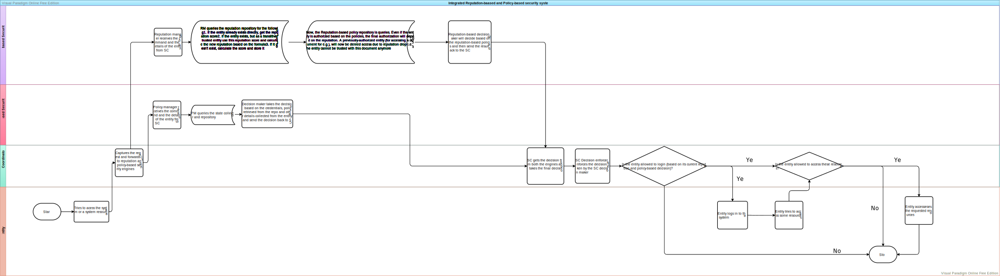

# Integration of Reputation and Policy-based Security

By RAMASUBRAMANIYAN G (2022MT12474)

# Table of Contents

-   [Integration of Reputation and Policy-based Security](#integration-of-reputation-and-policy-based-security)
-   [Table of Contents](#table-of-contents)
-   [Introduction](#introduction)
    -   [Everyday Examples of Reputation mechanism](#everyday-examples-of-reputation-mechanism)
        -   [Sophos Intercept X for Mobile](#sophos-intercept-x-for-mobile)
        -   [Windows Defender Smart Screen](#windows-defender-smart-screen)
        -   [Password Managers and Authenticators](#password-managers-and-authenticators)
        -   [Hashicorp Vault](#hashicorp-vault)
        -   [VS Code Workspace Trust](#vs-code-workspace-trust)
        -   [GitHub Repositories and Apps in the Marketplace](#github-repositories-and-apps-in-the-marketplace)
        -   [Google Play Protect](#google-play-protect)
        -   [Social Authentication](#social-authentication)
        -   [Emails](#emails)
    -   [Reputation-based Security](#reputation-based-security)
        -   [What is a Reputation-based Policy?](#what-is-a-reputation-based-policy)
        -   [Reputation Classes](#reputation-classes)
        -   [Class 0: Isolation](#class-0-isolation)
            -   [Advantages](#advantages)
            -   [Disadvantages](#disadvantages)
        -   [Class 1: Temporal Trust](#class-1-temporal-trust)
            -   [Advantages](#advantages-1)
            -   [Disadvantages](#disadvantages-1)
        -   [Class 2: Trust Chain](#class-2-trust-chain)
            -   [Advantages](#advantages-2)
            -   [Disadvantages](#disadvantages-2)
        -   [Class 3: Trust Chain with Persistent Trust](#class-3-trust-chain-with-persistent-trust)
            -   [Advantages](#advantages-3)
            -   [Disadvantages](#disadvantages-3)
        -   [Reputation calculation](#reputation-calculation)
            -   [Weights of the factors](#weights-of-the-factors)
        -   [Stack Exchange reputation model - An example](#stack-exchange-reputation-model---an-example)
    -   [Policy-based reputation system](#policy-based-reputation-system)

# Introduction

This document deals with the integration of the reputation-based and the policy-based security policies. The word reputation has a vague meaning. So, I have defined what reputation is and I have I have devised a framework to quantify the reputation based on various factors. Policy-based mechanisms are used for verification of the identity of an entity.

## Everyday Examples of Reputation mechanism

### Sophos Intercept X for Mobile

This is a top-rated antivirus according to [AV-Test](https://www.av-test.org/en/antivirus/mobile-devices/). Whenever the following happens, the antivirus will give a notification to the user and block the app from opening.

1. Low-reputation app. This means that the app is
    1. Not downloaded from the original source
    2. Patched with user-provided patches (via. modded APKs, Lucky patcher, or custome `.dex` patching)
    3. Not popularly downloaded or has a low rating or has many negative reviews
2. App is not signed by the original developer

The above all denotes that the app has a very low reputation and hence it is not safe to open. This is different from an actual malware which the antivirus will detect as malware and not a low-reputation app.

### Windows Defender Smart Screen

Just like Sophos, Windows Defender also has a reputation-based mechanism. WDSS will notify the user that the app they are trying to open may be malicious or has a lowe reputation. The user must then decide whether to open the app or not. This is hidden inside `More options` link to discourage the users to open the executable.

### Password Managers and Authenticators

There are several password managers that we **trust** our credentials to. This trustworthiness is evaluated by the user based on the **reputation** of the password manager, popularity, ability to store crendentials securely, random password generation in a secure manner, auto-fill, history of breaches (if any), password strength assessment, etc. The password managers are better option than storing passwords in a browser as browsers are very vulnerable to attacks.

Also, since they store the credentials, they are also used for policy-based security measures. But they just store the credentials in a secure way. But for storing these credentials, and to access these credentials, the user must be trusted by the password manager based on the credentials the user provides (policy-based security measure at play).

Authenticators are also used for policy-based security measures. But they are primarily used for MFA besides storing the password (for eg. Microsoft Authenticator). They also store addresses cards (in a way dictated by RBI guidelines for eg. in India) and other credentials. These authenticators again need to verify the identity of the user to access the credentials which serve the purpose of identity verification in some other website.

### Hashicorp Vault

This is used for identity-based access management for several sources. This vault is used for the following purposes

1. Automated PKI infrastructure
2. Data Encryption and Tokenization
3. DB Credential rotation
4. Dynamic secrets
5. Identity-based access management
6. Key management
7. Kubernetes secrets
8. Secrets management

The above all contribute to the policy-based security measures. The user trusts the vault with all the above to store them in a secure way and to retrieve them securely after verification of the identity of the user.

### VS Code Workspace Trust

In `VSCode`, whenever we open a new workspace, it will ask for trusting the workspace. If we don't, the settings will be disabled and the extensions will not be able to run. This is because, as VSCode can execute a code, it can also execute a malicious code. This can gain control of the computer, and use VSCode and its vulnerabilities to gain access to the user's data. So, VSCode asks for trust to ensure that the workspace is safe to open. This trust is left to the user to decide.

### GitHub Repositories and Apps in the Marketplace

Users while deciding for which open source software to try, go to GitHub and check if the repo has good number of starts and good number of reviews. Also, they check the last commit date to see if the repo is still maintained. They also check if the issues are considered and are being fixed regularly. They also check for the new features added. This is a good example of reputation-based security. The trustworthiness of a repo is decided by the number of stars, number of reviews, last commit date, number of issues, number of pull requests, active community support, etc. Even if it is a config file such as `dotfiles`, the user will go with the `dotfile` that is most chosen and adopted for everyday use. The example of these `dotfiles` can be `.vimrc`, `init.vim`, `.zshrc`, `.bashrc`, `spacevim.toml`, `.spacemacs` etc. These are all config files used for configuring the terminal and the editors such as `Vim`, `Neovim` and `Spacemacs`. This is anoter example of reputation-based security.

GitHub also introduces passwordless sign in through `git` because of the attacks that passwords are subjected to. We have to create a token for signing into GitHub via `git` or `gh` client (official GitHub CLI).

Similar to the GitHub repos, the user chooses the app to download based on the trustworthiness perceived from the number of stars for the app, the number of reviews, number of people who provided the rating etc. This is also a good example of reputation-based security.

Also, we can push to any repository with any `username` and `email` that we have configured using the following commands.

```git
git config --global user.name "username"
git config --global user.email "email"
```

This doesn't gain any high reputation. Also anybody can contribute to these repositories. This is the reason why several Enterprises with critical infrastructure such as banks host their own instance of versioning in Bitbucket and discourage and block Github completely (both read and write). Besides, if all the code in GitHub were devoid of vulnerabilities and bugs, then there would have been no need for VSCode to ask for trust for projects opened in VS Code directly from GitHub.

Also, `git` as a tool discourages self-signed certificates. This one is policy-based security measure.

### Google Play Protect

Google Play protect is again listed in the AV-Test website but it doesn't do well compared to the alternatives such as Sophos discussed above. Yet, GPP will warn the user regarding the app being installed from an unknonw source. GPP identifies this as a malware or as a low-reputation app. This is again a good example of reputation-based security.

### Social Authentication

With the same GitHub credentials, we can also login to Microsoft. This is because GitHub is a trusted source for MS Authentication. This is an example of reputation-based security and policy-based security. All the websites use the social authentication based on the trustworthiness of the social authentication provider. Even when using the Social Auth, the user will be asked to give access to certain information requested by the website explicitly. This is to prevent the website from accessing the user's data without the user's consent. Thus, if the user gives those permissions, user trusts the website with the data. This is an example of reputation and policy-based security.

### Emails

Email clients will not trust an email whose `SPF`, `DMARC` and `DKIM` records are not passed. This is because, if the email is not trusted, it can be a phishing email. The email client will also check if the email is from a trusted domain. If the email is from a trusted domain, it will be marked as trusted. If the email is from a non-trusted domain, it will be marked as spam. This is another example of reputation-based security. It is possible to have a verified badge in Email accounts by obtaining security certificates from trusted root certificate authorities, for example, Trustifi, Comodo, etc. The spam mails identified by the email clients mostly tend to be from non-trusted domains, have malicious links or have a low reputation.

## Reputation-based Security

This section deals with what a reputation-based policy is and how the reputation can be evaluated. This section also deals with some of the models that are already in existence for the calculation of reputation.

### What is a Reputation-based Policy?

Reputation of an entity is based on the following factors

1. The number of times the entity has been involved in a transaction.
2. Relationship among these entities in the system considered
3. History of the entities
    1. For example, legal actions against the entity, quality of the product being poor in the past, embezzlement of funds, etc.
4. The system in which the entity is involved
    1. For example, the system is a financial system, a social media system, a medical system, workplace/corporate system etc.
5. Characterisitcs of each entity
    1. For example, the entity is a person, a company, a government, a machine, etc.
    2. Even among the organizations or governments involved, each of them may have different policies, standards, etc. and each of them may have different line of work
6. How long the entity has been involved in the system
7. Rating of the entity in the system as a whole which are affected by the interactions of the entity will other entities in the system.
8. Rating of the entity in the cluster to which it belongs to. The cluster can be based on several factors, for example, type of work.
9. Number of other entities that have rated the entity in the system as a whole.
10. Number of other entities that have rated the entity in the cluster to which it belongs to.
11. Verification status
    1. For example, in a seller environment, a verfied seller is more reputable than an unverified seller.
    2. This is also true for online accounts, where a verified account is more reputable than an unverified account.

Reputation score is calculated based on the above factors. I have devised several classes of reputation based on the reputation score. The classes are discussed in the next section.

### Reputation Classes

### Class 0: Isolation

I got this inspiration from `Qubes OS`. In this class, all entities are isolated from the system. This class also doesn't support **transitive trust**. Just like all the applications in `Qubes OS` runs in a separate container isolated from everything else even if all of them run in the same OS, even if all the entities belong to the same system, the entities need to establish trust along with its reputation score each time it interacts with other entities. This is the highest class of reputation.

##### Advantages

1. Since the reputation is calculated each time, this class is the most secure class. Had the reputation been calculated once and stored, it would have been vulnerable to attacks because, at some point the entity could have been compromised and could have been used to attack other entities in the system. So, this way by keeping the reputation of all the entities as 0, the system is more secure.
2. By getting rid of the transitive trust, we can get rid of the trust chains. This is because, in the trust chain, if one of the entities in the chain is compromised, the whole chain is compromised. This is secure because, the policy of the entity that has just proven its trust score could have a security policy that has persistent trust on other entity which in turn could have been compromised. So, the transitive trust could lead us to belive an actually untrustworthy entity. This is not safe. Hence, the transitive trust is eliminated to keep the system more secure.

##### Disadvantages

1. Since the trust must be calculated for each entity every time, this is really time consuming and resource intensive. This is not scalable. This is not practical.
2. This can lead to huge delays in the system whenever a transaction/interaction between two entities is to be made.
3. If an entity has a very high reputation score, and if it wants to interact with an entity which has the above model, then the entity with the high reputation score will have to prove its trustworthiness each time it interacts with the entity with the above model making the transaction very slow and resource intensive and hence costing both the entities a lot of resource. This again leads to drop in the reputation of both the entities due to the delays and the resource consumption. Thus, this can discourage the entities from interacting with each other.

### Class 1: Temporal Trust

In this class, the reputation score is calculated once and stored for a certain amount of time. This class also doesn't support transitive trust. But because of the trust contract established between both the enties, the transactions and interactions will be smoother than Class 0.

##### Advantages

1. Faster interactions and transactions than Class 0.
2. Less resource intensive than Class 0.

##### Disadvantages

1. There is no guarantee that the entity will not be compromised in the time period for which the reputation score is stored. So, the reputation score could have become invalid during that period.
2. Absence of transitive trust is another drawback of this class. Had the transitive trust been present, another entity which was swift to capture the maliciousness of the compromised entity could have saved the uncompromised entity from being the victim.

### Class 2: Trust Chain

This class is an extension of Class 1. It supports the transitve trust. On interaction, the entities will check the trusted entities and the entities trusted by the trusted entities and so on. Now the system will be secure only if the compromised entity is immediately identified and notified to all the other trusted enties. That is, one of the entities can identify the compromised entity (for example, an entity with state-of-the-art security solution) and then notify all the other uncompromised entities. Since, several entities can do this parallely, the communication (message) overhead will be of the order $\mathcal{O}(kn)$ where $k$ is the number of entities sending the message and $n$ is the total number of entities in the system.

##### Advantages

1. Faster interactions and transactions than Class 1
2. Entities which are already truested by the trusted enties need not prove their reputation and hence lesser resource consumption than Class 1 and hence faster transactions and interactions than Class 1.

##### Disadvantages

1. The system is still vulnerable to the compromised entity. If the compromised entity is not identified and notified to all the other entities, then the entire system is vulnerable to the compromised entity.
2. The notification carries a lot of overhead

### Class 3: Trust Chain with Persistent Trust

This class is the least secure of all. Due to persistent trust, the entity will still trust another entity which is compromised and this trust will be permanent. So, this significantly lowers the protections of the trusting entity.

##### Advantages

1. Faster interactions and transactions than Class 2

##### Disadvantages

1. This class is extremely vulnerable to attacks.
2. It is the least secure class of all.

### Reputation calculation

Reputation of an entity is calculated based on the following factors

1. Popularity index ($p$)
2. Security model of the entity. This is measured based on the following factors
    1. Establishment of security framework based on top security standards (for example, ISO 27001, NIST, etc.) ($f$)
    2. Detection, Identification, Response and recovery to security incidents ($d$)
    3. Security hardening measures taken by the entity ($h$)
    4. Security awareness, training & cyber vigilance ($a$)
3. Secure interactions and enforcement of strict security guidelines ($e$)
4. Resilience of the entity ($r$)
5. Reputation of the entity in its cluster ($c_r$)
6. Longevity of the entity in the system ($l$)
7. Rating of the entity in the system as a whole ($s_r$)
8. Rating of the entity in the cluster to which it belongs to ($c_R$)
9. Rating of the other entities which have given rating to this entity ($o_r$)
    - This is needed because other low-rated entitites could have rated a malicious entity high and hence the malicious entity could have a high reputation score. So, this factor is needed to counter this.
10. Verification status ($v$)

The reputation of the entity in the system can be calculated as follows

$$
R = \frac{pw_p + fw_f + dw_d + hw_h + aw_a + ew_e + rw_r + c_rw_{c_r} + lw_l + s_rw_{s_r} + c_Rw_{c_R} + o_rw_{o_r} + vw_v}{w_p + w_f + w_d + w_h + w_a + w_e + w_r + w_{c_r} + w_l + w_{s_r} + w_{c_R} + w_{o_r} + w_v}
$$

where $w_i$ is the weight of the factor $i$ (which is one of the above described factors).

#### Weights of the factors

The weights of the factors will be decided based on the following factors

1. Source of the metric under consideration i.e. for example, if $p = 7$, and this value is obtained through a casual discussion between the scorer and another friend of his, then this weight is not trustworthy. But if this value is obtained through scientific means (by the entity calculating this metric) such as a thorough research, then this will have very high credibility because the "source" is the same entity and the "means" (next point discussed) is through scientific research and analysis. This weight of weight, denoted by $W_s$, lies between $0$ and $1$. This denotes the amount of credibility the source has. If the source is a trusted means such as the highest trusted entity or scientific means then the value will be very close to $1$. The source need not be trusted directly by the metric calculator but the trustworthiness of the one whose metric is calculated must be high to get this value close to 1
2. Means through which the metric is calculated or the reputation regarding an entity is obtained. A scientific means is more reputable than just a formal argument or discussion. ($W_m$)
3. Transparency of the entity on the necessary parameters required for the calculation of the metric. This doesn't include the trade secrets, the product release strategy etc. of the entity for example. These things can't be considered as these are proprietary and copyrighted materials. Transparency in the necessary evaluation metrics is necessary ($W_t$)
4. Accuracy. The information provided for the evaluation must be accurate. If the information provided is not sufficient enough or has contradictory information, then the accuracy of the evaluation will be low. ($W_a$)
5. Trustworthiness of the information. Just because a trusted entity provided the information, it doesn't mean that the information is trustworthy. The information must be accurate, reliable, provable, correct as verified via independent means and must be obtained through a trustworthy source. By default, calculator of the metric has the highest trustworthiness. But this does not mean that there are no insider threats or falsfication of data or the metric value by the invididuals of the entity, this is just to keep the framework simple. ($W_i$)
6. Evaluation process must be transparent, standardized, accurate, complete, reliable, correct, verifiable, reproducible, and must be done by a trusted entity. ($W_e$)

$W_i$ is different from $w_j$ for given factors $i$ (from weights of factos) and $j$ (from the factors) in the sense that $W_i$ is the assigns weightage to the information, the way in which information was obtained, the method used for evaluating the metric and the evaluation process itself and $w_j$ is the weight of the factor $j$ which denotes how much does each factor contribute to the reputation calculation of the entity as a whole

The modified reputation of the entity in the system can be calculated as follows

The weightage of the factors has a compounding effect on the reputation of the entity. The weightage for a particular factor $j$ is calculated as follows

$$
W_j = W_{s,j}W_{m,j}W_{t,j}W_{a,j}W_{i,j}W_{e,j}
$$

The modified reputation of the entity in the system can be calculated as follows

$$
R' = \frac{\displaystyle\sum_j jW_jw_j}{\displaystyle\sum_j W_jw_j}
$$

where $j \in \{p, f, d, h, a, e, r, c_r, l, s_r, c_R, o_r, v\}$

### Stack Exchange reputation model - An example

For a user to upvote or downvote a certain reputation needs to be present. This model discourages the unreputed users to damage the credibility or reputation of other users. The reputation is earned if the community feels that the question asked by the user or the answer (solution) provided for a problem by the user is correct and satisfactory (10 for each upvote and on top of that 15 points if the answer is marked as the solution chosen by the asker).

Reputation is lost if the user doesn't meet the community standards through the questions asked in the community or the answer is incorrect or doesn't solve the problem or is irrelevant to the question.

When users reach a certain reputation, they will be assigned certain roles such as moderators etc. These moderators oversee the community for correct and relevant questions and answers. They can also delete the questions or answers which are irrelevant or incorrect. They are also allowed to edit the question in terms of the title, details and tags and the answer to make it more relevant and correct.

The downvoting system is also used to prevent spamming and also to hold up the community standards. The moderators can close a question as off-topic so that the community is unadultered by irrelevant questions.

## Policy-based reputation system

In the policy-based security measure, the user must have to provide the credentials and the set of policies will determine the trustfulness of the entity. Either the entity is allowed or not allowed according to the set of policies.

The components of the policy-based security are as follows:

1. Policy Manager
2. State Collector and Repository
3. Decision Maker
4. Decision Enforcer

### Policy Manager

Policy manager coordinates different entities and it forwards the flow to the State collector and Repository

### State Collector and Repository

State Collector and Repository collects the flow and it contains different policy rules. After fetching the rules, it is sent to the Decision Maker

### Decision Maker

Decision Maker finds the exact security match and forwards it to Decision Enforcer

### Decision Enforcer

Decision Enforcer enforces the decision based on the policy and the state of the entity

### Examples

There are several examples of policy-based security mechanisms

1. Username & password combination along with the underlying policies for that user
    - For example, a user can be allowed to connect via `SSH` but may not be able to access a resource. This is enforced by the policies. The user is verified by authentication mechanisms
2. PKI infrastructure in cloud computing
3. IAM in AWS
4. SAML
5. OAuth
6. SSO

## Integration of reputation and policy-based security

The integration of the reputation and policy-based security can be done as shown in the following figure


<center>
    <em>
        <b>
            Figure 1. Components of Integrated Reputation-based and Policy-based
            Security
        </b>
    </em>
</center>

In Figure 1, though the reputation policy repository is queried, the result given by it will depend based on the class of reputation. For example, if the classes is chosen to have a temporal trust, then the repository will store the entity in the trusted DB for that amount of time. Querying about that entity after that period will return a null value since the entity would have been destroyed from the trust DB.

The workflow of the integrated reputation and policy-based security is shown below:



<center>
    <em>
        <b>
            Figure 2. Flowchart for the Integrated Reputation-based and
            Policy-based Security
        </b>
    </em>
</center>

## Conclusion

Thus, the integration of the reputation-based and policy-based security systems is implemented.

# References

<div class="references">
    <b>[1]</b> Li Xiong and Ling Liu, "A reputation-based trust model for
    peer-to-peer e-commerce communities," EEE International Conference on
    E-Commerce, 2003. CEC 2003., 2003, pp. 275-284, doi:
    10.1109/COEC.2003.1210262. <br />
    <b>[2]</b> Wong, A. D., Unman, &amp; Marczykowski-Górecki, M. (2021, July 9).
    Security design goals. Qubes OS. Retrieved November 6, 2022, from https://www.qubes-os.org/doc/security-design-goals/#:~:text=Qubes%20OS%20implements%20a%20security,running%20under%20the%20Xen%20hypervisor.
    <br />
    <b>[3]</b> K. Sood, K. K. Karmakar, V. Varadharajan, U. Tupakula and S. Yu, "Analysis
    of Policy-Based Security Management System in Software-Defined Networks," in
    IEEE Communications Letters, vol. 23, no. 4, pp. 612-615, April 2019, doi: 10.1109/LCOMM.2019.2898864.
    <br />
    <b>[4]</b> Huang, J., Nicol, D.M. Trust mechanisms for cloud computing. J Cloud
    Comp 2, 9 (2013). https://doi.org/10.1186/2192-113X-2-9
    <br />
    <b>[5]</b> Bonatti, P., Duma, C., Olmedilla, D., &amp; Shahmehri, N. (n.d.).
    An Integration of Reputation-based and Policy-based Trust Management. Network
    of Excellence REWERSE, IST-506779, 1–6.
    <br />
    <b>[6]</b> Siddiqui, Muhammad & Gir, Alam & Lundberg, Jenny. (2011). An Integration
    of policy and reputation based trust mechanisms. 10.13140/RG.2.2.30747.41767.
    <br />
</div>

# Tools used

1. [Docusaurus](https://docusaurus.io/)<br/>
2. [Visual Paradigm Online](https://online.visual-paradigm.com/) <br/>
3. [Draw.io](https://app.diagrams.net/)<br/>
